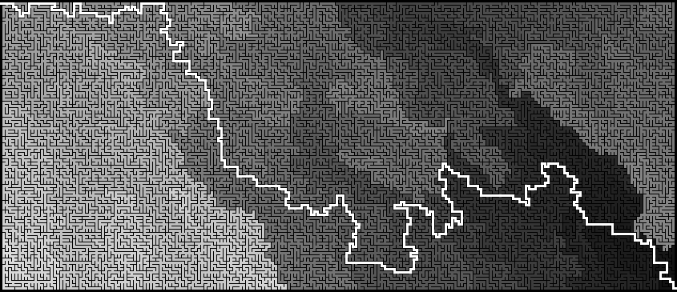

# CudaMaze
<div style="text-align: center;">
<pre>
+++---------------------------------------------------------------------------------------------------+++
      |                                           |           |                                       |||
|||   +---+---+---+---+---+   +---+---+---+---+---+   +---+---+---+---+---+   +---+---+---+---+---+   |||
|||   |...................|   |...................|   ....................|   |....................   |||
|||   +...+---+...+---+...+   +...+---+---+---+...+   +---+---+---+---+...+   +...+---+---+---+---+   |||
|||   |...|   |...|   |...|   |...|            ...|   |           |.......|   |...|                   |||
|||   +...+   +...+   +...+   +...+---+---+---+...+   +   +---+---+...+---+   +...+---+---+---+---+   |||
|||   |...|   |...|   |...|   |.......|...........|       |...........|       |...................|   |||
|||   +...+   +...+   +...+   +...+---+---+---+...+   +---+...+---+---+   +   +...+---+---+---+---+   |||
|||   |...|   |...|   |...|   |...|           |...|   |.......|           |   |...|                   |||
|||   +...+   +---+   +...+   +...+   +   +   +...+   +...+---+---+---+---+   +...+---+---+---+---+---|||
|||   ....|           |....   ....|   |   |   |....   |....................   |....................   |||
|||   +---+   +---+   +---+   +---+   +---+   +---+---+---+---+---+---+---+   +---+---+---+---+---+   |||
|||               |   |               |                           |                               |      
+++---------------------------------------------------------------------------------------------------+++
</pre>

</div>

Generate and solve perfect rectangular mazes using CUDA to accelerate processing on NVIDIA GPUs.
Maze generation uses kruskal's algorithm with optimization for rectangular maze.
Solving is performed on the CPU because much faster due to maze configuration.

## ⚡ Performance

The project leverages a hybrid CPU/GPU pipeline to maximize efficiency between generation speed and pathfinding logic.

### Computing Architecture :

- Generation: Hardware-accelerated on GPU.
- Solving: Computed on CPU.
- Image Export: GPU-accelerated image data preparation, then saved to disk via stb_image_write.

### Benchmarks

Tested on: CUDA 13.1 | NVIDIA GeForce RTX 4060 Ti | 13th Gen Intel® Core™ i5-13400F
```bash
./maze --verbose -na -Spf mazeSolve.png (w) (h)
```

| Maze (WxH)    | Gen (ms) | Solve (ms) | Save (ms) |
|---------------|----------|------------|-----------|
| 256x256       | 102      | 3          | 61        |
| 512x512       | 103      | 13         | 232       |
| 1,024x1,024   | 115      | 56         | 931       |
| 1,920x1,080   | 129      | 114        | 1,873     |
| 2,560x1,600   | 126      | 219        | 3,662     |
| 4,096x4,096   | 223      | 897        | 18,105    |
| 8,192x8,192   | 630      | 3,742      | 65,215    |

### Performance Note

- **Scale Factor**: The output image resolution is significantly larger than the maze grid. With a default wall size of 3, the final image resolution is 4x larger than the maze dimensions (e.g., an 8k maze produces a ~32k image).
- **Bottleneck**: The "Save" time is dominated by the PNG compression overhead on the CPU. While the GPU prepares the raw data instantly, encoding a high-resolution PNG is a single-threaded CPU-bound process.
- **Methodology**: These statistics are one-shot measurements provided for indicative purposes and are not averaged over multiple runs.

## 📋Requirements

- **CMake** (version 3.29 or above)
- **CUDA Toolkit** (compatible with your NVIDIA GPU)
- **Compiler C++20** (GCC, Clang or MSVC)
- **NVCC** with support of C++20
- **Git** for clone repository

## 🛠️Building from source

```bash
git clone https://github.com/Carlier-Maxime/cudaMaze
cd cudaMaze
mkdir build
cd build
cmake ..
cmake --build .
```

## 💡Usage

### Basic Usage
```bash
./maze (width) (height)
```
You can specify width and height of maze

### Save to png & solve
```bash
./maze -pf maze.png -S -Spf mazeSolve.png
```
-pf \<file\> specify png file for save maze no solved.<br>
-S solve maze and print path and solved maze to stdout.<br>
-Spf \<file\> specify png file for save maze solved.<br>

### Help
```bash
./maze --help
```
Show all parameters

## 📝Examples
Input:
```bash
./maze 10 5
```
Output:
```text
+++---------------------------------------+++
                                      |   |||
|||---+---+   +---+---+---+   +---+   +   |||
|||                       |   |       |   |||
|||---+   +---+---+---+   +---+---+---+   |||
|||                   |                   |||
|||   +   +---+---+---+---+   +   +   +---|||
|||   |               |   |   |   |   |   |||
|||   +---+   +---+   +   +   +   +   +   |||
|||       |       |       |   |   |          
+++---------------------------------------+++
```
---
Input:
```bash
./maze 10 5 -S
```
Output:
```text
+++---------------------------------------+++
                      |       |           |||
|||---+   +---+---+---+---+   +---+   +---|||
|||                       |               |||
|||   +---+---+---+---+---+   +---+   +   |||
|||           |                   |   |   |||
|||   +   +   +   +---+   +   +---+   +   |||
|||   |   |           |   |       |   |   |||
|||---+   +---+   +---+   +---+---+   +   |||
|||           |       |           |   |      
+++---------------------------------------+++

RDLDRRDRURRRURRRDDD

+++---------------------------------------+++
::::::::::            |       |           |||
|||---+:::+---+---+---+---+   +---+   +---|||
|||:::::::                |:::::::::::::::|||
|||:::+---+---+---+---+---+:::+---+   +:::|||
|||:::::::::::|:::::::::::::::    |   |:::|||
|||   +   +:::+:::+---+   +   +---+   +:::|||
|||   |   |:::::::    |   |       |   |:::|||
|||---+   +---+   +---+   +---+---+   +:::|||
|||           |       |           |   |::::::
+++---------------------------------------+++
```
---
Input:
```bash
./maze 20 10 -S --verbose
```
Output:
```text

Maze: 20x10 with seed 1760527501
check parameter, complete in : 0 ms
allocate data, complete in : 122 ms
init data, complete in : 8 ms
shuffle weights, complete in : 1 ms
break walls, complete in : 4 step(s), 1 ms
transfer result, complete in : 0 ms
free data, complete in : 0 ms
maze (20x10) build complete in : 133 ms

+++-------------------------------------------------------------------------------+++
                  |                               |           |                   |||
|||   +   +---+---+   +   +---+---+---+   +---+---+   +---+---+---+---+   +---+   |||
|||   |           |   |           |   |           |               |           |   |||
|||   +   +   +   +   +---+---+---+   +---+---+---+   +---+---+   +---+   +   +---|||
|||   |   |   |   |           |                   |   |       |       |   |       |||
|||---+   +---+---+   +---+   +   +---+   +---+---+   +   +   +   +---+   +---+---|||
|||               |       |   |       |           |       |   |       |           |||
|||   +---+   +---+   +---+   +---+   +---+   +---+   +---+---+---+---+   +---+   |||
|||       |       |       |       |   |   |       |               |           |   |||
|||---+   +---+---+---+   +---+---+   +   +   +   +---+---+   +   +---+   +---+   |||
|||                               |       |   |           |   |   |   |       |   |||
|||   +---+   +   +---+---+---+---+   +   +---+---+---+   +   +---+   +   +---+---|||
|||   |       |       |           |   |               |       |                   |||
|||   +   +   +---+   +   +   +   +---+---+   +---+---+---+   +   +   +---+---+   |||
|||   |   |       |   |   |   |           |               |   |   |       |       |||
|||---+   +   +---+   +   +   +---+   +---+   +   +---+---+   +   +---+---+   +---|||
|||       |       |   |   |       |       |   |           |   |           |       |||
|||---+---+---+   +---+---+---+   +   +---+   +   +---+---+   +---+   +---+---+---|||
|||                               |           |           |                          
+++-------------------------------------------------------------------------------+++

RDDDLDRDRDDDRDRRRRULUURDRDDRRUUULULUULURRDRDRDRRDRDDDRRRRR
Solve Maze in : 0 ms

+++-------------------------------------------------------------------------------+++
::::::::::        |                               |           |                   |||
|||   +:::+---+---+   +   +---+---+---+   +---+---+   +---+---+---+---+   +---+   |||
|||   |:::        |   |           |   |           |               |           |   |||
|||   +:::+   +   +   +---+---+---+   +---+---+---+   +---+---+   +---+   +   +---|||
|||   |:::|   |   |           |:::::::::::        |   |       |       |   |       |||
|||---+:::+---+---+   +---+   +:::+---+:::+---+---+   +   +   +   +---+   +---+---|||
|||:::::::        |       |   |:::::::|:::::::    |       |   |       |           |||
|||:::+---+   +---+   +---+   +---+:::+---+:::+---+   +---+---+---+---+   +---+   |||
|||:::::::|       |       |       |:::|   |:::::::|               |           |   |||
|||---+:::+---+---+---+   +---+---+:::+   +   +:::+---+---+   +   +---+   +---+   |||
|||    :::::::                    |:::::::|   |:::::::::::|   |   |   |       |   |||
|||   +---+:::+   +---+---+---+---+   +:::+---+---+---+:::+   +---+   +   +---+---|||
|||   |    :::|       |    :::::::|   |:::::::        |:::::::|                   |||
|||   +   +:::+---+   +   +:::+:::+---+---+:::+---+---+---+:::+   +   +---+---+   |||
|||   |   |:::    |   |   |:::|:::::::    |:::            |:::|   |       |       |||
|||---+   +:::+---+   +   +:::+---+:::+---+:::+   +---+---+:::+   +---+---+   +---|||
|||       |:::::::|   |   |:::::::|:::    |:::|           |:::|           |       |||
|||---+---+---+:::+---+---+---+:::+:::+---+:::+   +---+---+:::+---+   +---+---+---|||
|||            :::::::::::::::::::|:::::::::::|           |::::::::::::::::::::::::::
+++-------------------------------------------------------------------------------+++

Print maze solve in : 1 ms
```

## ⚠️Warnings
- Setting the seed does not guarantee that you will get exactly the same maze due to parallelization.
